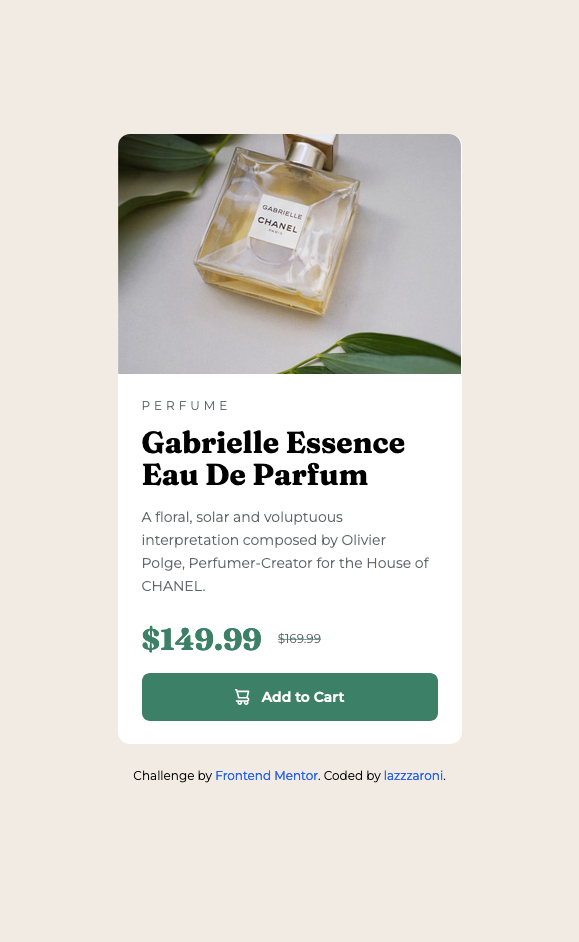

# Frontend Mentor - Product preview card component solution

This is a solution to the [Product preview card component challenge on Frontend Mentor](https://www.frontendmentor.io/challenges/product-preview-card-component-GO7UmttRfa). Frontend Mentor challenges help you improve your coding skills by building realistic projects.

## Table of contents

- [Frontend Mentor - Product preview card component solution](#frontend-mentor---product-preview-card-component-solution)
  - [Table of contents](#table-of-contents)
  - [Overview](#overview)
    - [The challenge](#the-challenge)
    - [Screenshot](#screenshot)
    - [Links](#links)
  - [My process](#my-process)
    - [Built with](#built-with)
    - [What I learned](#what-i-learned)
    - [Continued development](#continued-development)
    - [Useful resources](#useful-resources)
  - [Author](#author)

## Overview

### The challenge

Users should be able to:

- View the optimal layout depending on their device's screen size
- See hover and focus states for interactive elements

### Screenshot




### Links

- Solution URL: [GitHub Repo](https://github.com/lazzzaroni/product-preview-card-component)
- Live Site URL: [GitHub Pages](https://lazzzaroni.github.io/product-preview-card-component)

## My process

### Built with

- [React](https://reactjs.org/) - JS library
- [Next.js](https://nextjs.org/) - React framework
- [Tailwind CSS](https://tailwindcss.com/) - For styles

### What I learned

We can use semantic `<picture/>` tag to render images conditionally, without tracking window size with `useEffect` and `useState` hooks.

```html
<picture class="...">
  <source media="(min-width:768px)" srcset="..." />
  
</picture>
```

### Continued development

Continue learning semantic HTML elements.

### Useful resources

- [`<picture>`: The Picture element - HTML: HyperText Markup Language | MDN](https://developer.mozilla.org/en-US/docs/Web/HTML/Element/picture)

## Author

- Website - [mpaliakou.dev](https://mpaliakou.dev)
- Frontend Mentor - [@lazzzaroni](https://www.frontendmentor.io/profile/lazzzaroni)
